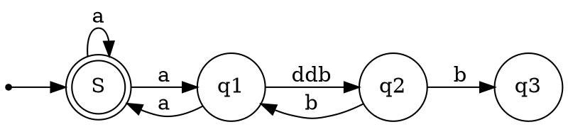

# 1

```regex
[a-z]*a[a-z]*e[a-z]*i[a-z]*o[a-z]*u[a-z]*
```

# 2
```regex
a*b*c*d*....*z*
```

# 3
```regex
\/\*.*(".*")*\*\/
```

# 4
```regex

```

# 9
```regex
b*a*|a+b
```


```graphviz
digraph finite_state_machine {
    rankdir=LR;
    size="8,5"

    node [shape = doublecircle]; S;
    node [shape = point ]; qi

    node [shape = circle];
    qi -> S;
    S  -> q1 [ label = "a" ];
    S  -> S  [ label = "a" ];
    q1 -> S  [ label = "a" ];
    q1 -> q2 [ label = "ddb" ];
    q2 -> q1 [ label = "b" ];
    q2 -> q3 [ label = "b" ];
}
```
