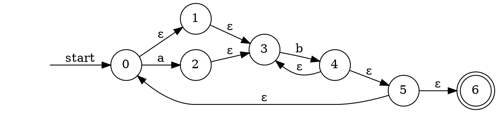
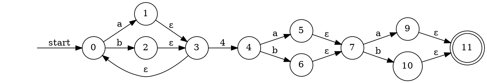

# 1
```dot
#a(a|b)*a
digraph LexicalAnalyzer {
    rankdir=LR; // 从左到右绘制
    node [shape = circle]; // 圆形节点

    startNode -> 0 [label = "start" ]
    0 -> 1 [label = "a"];
    1 -> 3 [label = "a"];
    1 -> 4 [label = "b"];
    3 -> 5 [label = "ε"];
    4 -> 5 [label = "ε"];
    5 -> 1 [label = "ε"];
    5 -> 6 [label = "a"];

    6 [shape = doublecircle]
    startNode [shape = none, label = ""]
}
}
```

# 2


# 3


