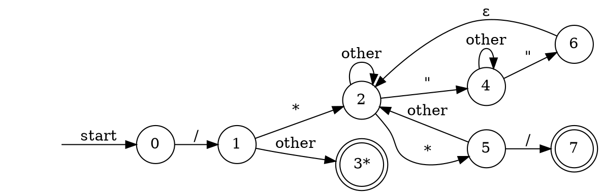

# 3

```dot
#\/\*.*(".*")*\*\/
digraph LexicalAnalyzer {
    rankdir=LR
    node [shape = circle]

    startNode -> 0 [label = "start" ]
    0 -> 1 [label = "/"]
    1 -> 2 [label = "*"]
    1 -> "3*" [label = "other"]
    2 -> 2 [label = "other"]
    2 -> 4 [label = "\""]
    2 -> 5 [label = "*"]
    4 -> 4 [label = "other"]
    4 -> 6 [label = "\""]
    5 -> 7 [label = "/"]
    5 -> 2 [label = "other"]
    6 -> 2 [label =  "ε"]


    "3*" [shape = doublecircle]
    7 [shape = doublecircle]
    startNode [shape = none, label = ""]
    otherEndNode [shape = none, label = ""]
}
```
