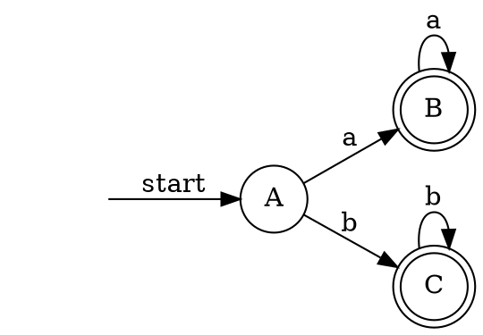
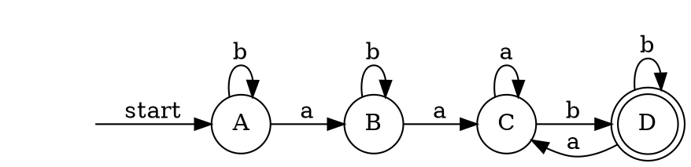
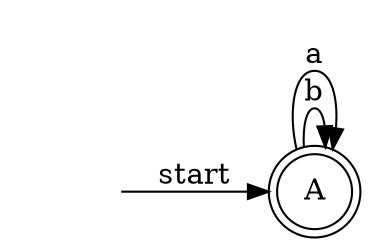

- *为接受状态集
# 3-26

ε-closure(s0) = {0, 1, 3} = A

move(A, a) = {2}

ε-closure(move(A, a)) = B*

ε-closure(move(B, a)) = B*

move(A, b) = {4}

ε-closure(move(A, b)) = C*

ε-closure(move(C, b)) = C*

# 3-29

ε-closure(s0) = {0} = A

ε-closure(move(A, a)) = {0, 1} = B

Dtran[A, a] = B     // A -> B [label = a]

ε-closure(move(A, b)) = {0} = A

Dtran[A, b] = A

ε-closure(move(B, a)) = {0, 1, 2} = C

Dtran[B, a] = C

ε-closure(move(B, b)) = {0, 1} = B

Dtran[B, b] = B

move(C, a) = {0, 1, 2} = C

ε-closure(C) = {0, 1, 2} = C

Dtran[C, a] = C

move(C, b) = {0, 1, 2, 3} = D*

ε-closure(D) = D

Dtran[C, b] = D

ε-closure(move(D, a)) = {0, 1, 2} = C

Dtran[D, b] = C

ε-closure(move(D, b)) = {0, 1, 2, 3} = D

Dtran[D, b] = D

# 3-30

| label | contains |
|--|--|
| A* | 0, 1, 2, 3 |

ε-closure(s0) = {0, 1, 2, 3} = A*

ε-closure(move(A, a)) = {0, 1, 2, 3} = A*

ε-closure(move(A, b)) = {0, 1, 2, 3} = A*

