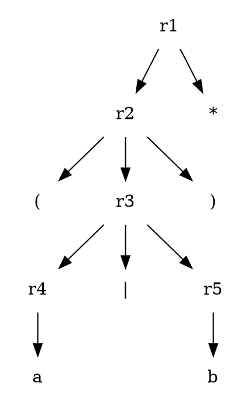
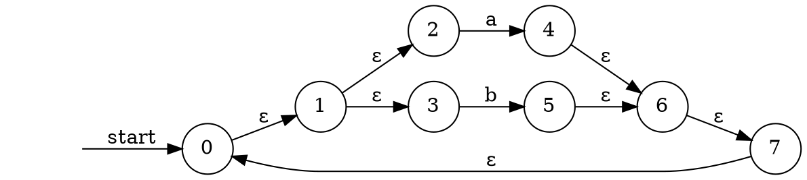
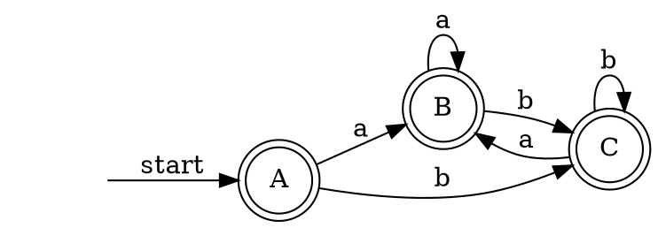

# `(a|b)*`

| node | contain |
|--|--|
| A* | 0, 1, 2, 3 |
| B* |  1, 2, 3, 4, 6, 7 |
| C* |  1, 2, 3, 5, 6, 7 |

ε-closure(0) = {0, 1, 2, 3, 7} = A*

ε-closure(move(A, a)) = { 1, 2, 3, 4, 6, 7 } = B*

Dtran[A, a] = B

ε-closure(move(A, b)) = { 1, 2, 3, 5, 6, 7 } = C*

Dtran[A, b] = C

ε-closure(move(B, a)) = B 

Dtran[B, a] = B

ε-closure(move(B, b)) = C 

Dtran[B, b] = C

ε-closure(move(C, a)) = B

Dtran[C, a] = B

ε-closure(move(C, a)) = B

Dtran[C, b] = C

