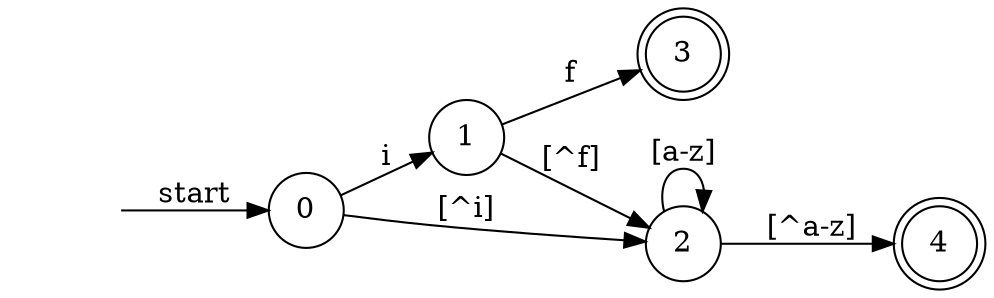

```graphviz
digraph NFA {
    rankdir = LR
    node [shape = circle]

    startNode -> 0 [label = "start"] 
    0 -> 1 [label = i]
    1 -> 3 [label = f]
    0 -> 2 [label = "[^i]"]
    1 -> 2 [label = "[^f]"]
    2 -> 2 [label = "[a-z]"]
    2 -> 4 [label = "[^a-z]"]
    
    3 [shape = doublecircle]
    4 [shape = doublecircle]
    startNode [shape = none, label = ""]
}
```