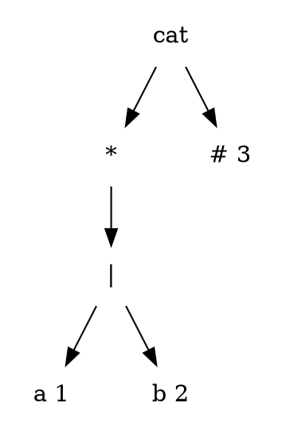
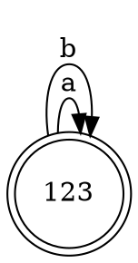
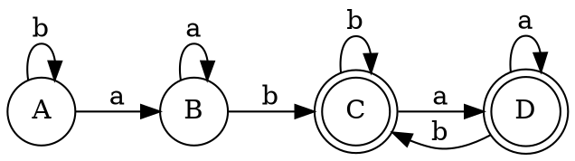

# `((a|b)*)#`



| n | nullable | firstpos | lastpos | followpos |
|---|----------|----------|---------|-----------|
| a | false | {1} | {1} | { 1, 2, 3 } |
| b | false | {2}   | {2} | { 1, 2, 3 } |
|\| | false | {1, 2} | {1, 2} | \\ |
| * | true  | {1, 2} | {1, 2} | \\ |
| # | false | {3} | {3} | empty |
|cat| false | {1, 2, 3} | {3} | \\ |


- 算法过程

firstpos(n_0) = firstpos(cat) = { 1, 2, 3 }

a -> { 1, 2, 3 }

U = followpos(1) = { 1, 2, 3 }

Dtran[{1, 2, 3}, a ] = {1, 2, 3}

b -> { 1, 2, 3 }

U = followpos(2) = { 1, 2, 3 }

Dtran[{1, 2, 3}, b ] = {1, 2, 3}




# `((a|b)*abb(a|b)*)#`


```graphviz
digraph sytaxTree
{
    node [shape=plaintext]
    cat0 -> cat1
    cat0 -> "# 7"
    cat1 -> cat2
    cat1 -> "star0"
    "star0" -> or0
    or0 -> "a 1"
    or0 -> "b 2"
    cat2 -> cat3
    cat2 -> "b 3"
    cat3 -> star1
    cat3 -> "a 4"
    star1 -> or1
    or1 -> "a 5"
    or1 -> "b 6"
}
```
| n     | nullable | firstpos | lastpos |
|-------|----------|----------|---------|
| cat0 | false |  {4, 5, 6} | {1, 2, 3} |
| cat1 | false | {4, 5, 6} | {1, 2, 3} |
| # 7  | false | {7} | {7} |
| star0| true  |  {1, 2} | {1, 2} |
| cat2 | false | {4, 5, 6} | {3} |
| b 3  | false | {3} | {3} |
| or0  | false | {1, 2} | {1, 2} |
| a 1  | false | {1} | {1} |
| b 2  | false | {2} | {2} |
| cat3 | false | {4, 5, 6} | {4} |
| a 4  | false | {4} | {4} |
| star1| true  | {5, 6} | {5, 6} |
| or1  | false | {5, 6} | {5, 6} |
| a 5  | false | {5} | {5} |
| b 6  | false | {6} | {6} |

| n | followpos |
|---|-----------|
|a 1| {1, 2, 7} |
|b 2| {1, 2, 7} |
|b 3| {1, 2, 7} |
|a 4| {3} |
|a 5| {4, 5, 6} |
|b 6| {4, 5, 6} |
|# 7| {} |


- 算法过程

a : 1, 4, 5

b : 2, 3, 6

firstpos(n_0) = {4, 5, 6} = A

### a -> A
a: 4, 5

U = { 3, 4, 5, 6 } = B

Dtran[A, a] = B

### b -> A
b: 6

U = { 4, 5, 6 } = A

Dtran[A, b] = A

### a -> B
a: 4, 5

Dtran[B, a] = B

### b -> B
b: 3, 6

U = { 1, 2, 4, 5, 6, 7 } = C

Dtran[B, b] = C

### a -> C
a: 1, 4, 5

U = { 1, 2, 3, 4, 5, 6, 7 } = D

Dtran[C, a] = D

### b -> C
b: 2, 6

U = C

Dtran[C, b] = C

### a -> D
a: 1, 4, 5

U = D

Dtran[D, a] = D

### b -> D
a: 2, 3, 6

U = C

Dtran[D, b] = C


| n | contains |
|--|--|
| A | { 4, 5, 6 } |
| B | { 3, 4, 5, 6 } |
| C | {1, 2, 4, 5, 6, 7} |
| D | {1, 2, 3, 4, 5, 6, 7} |


