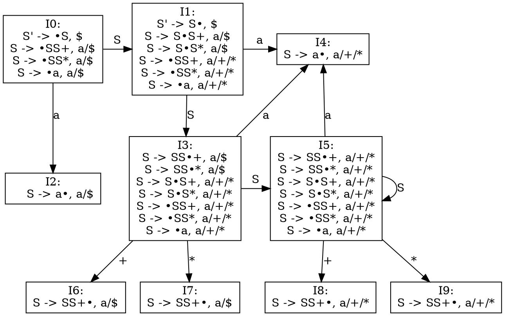
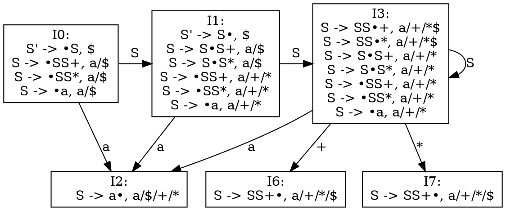

- 增广文法
```
S' -> S
1) S -> SS+
2) S -> SS*
3) S -> a

FIRST(S) = a
```
## LR(1)


| stat | action | | | | goto | 
|--|--|--|--|--|--|
| | `a` | `+` | `*` | `$` | S |
|0| s2  |     |     |     | 1 |
|1| s4  |     |     |     | 3 |
|2| r3  |     |     | r3  |   |
|3| s4  | s6  | s7  |     | 5 |
|4| r3  | r3  | r3  |     |   |
|5| s4  | s8  | s9  |     | 5 |
|6| r1  |     |     | r1  |   |
|7| r2  |     |     | r2  |   |
|8| r1  | r1  | r1  |     |   |
|9| r2  | r2  | r2  |     |   |

## LALR

- same as LR(0)
